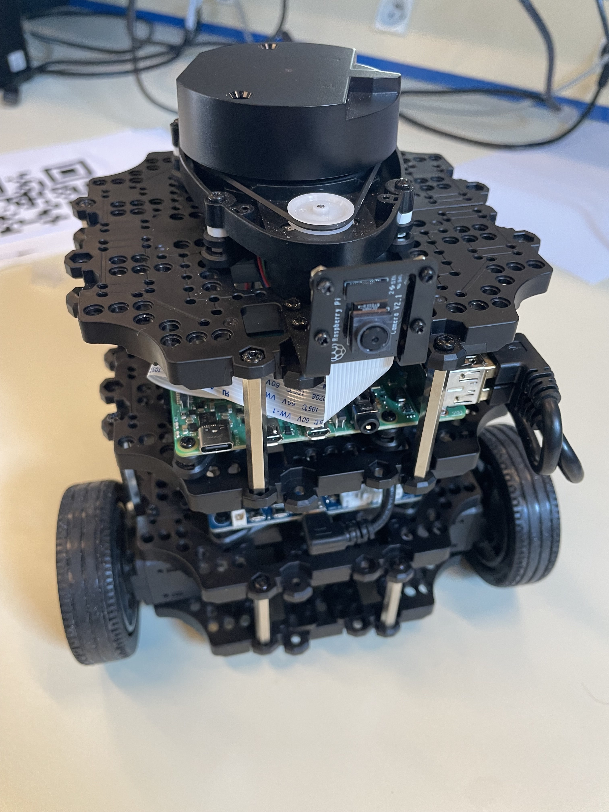

# 🎓 CentraleSupélec Thematic Sequence - SCOC

As part of my studies at **CentraleSupélec**, during the **second semester of my first year** (equivalent to the end of my third
year post-baccalaureate), I had the opportunity to take a course in **Information Theory** as part of the thematic sequence **SCOC**. 📘🔢

At the end of this course, the **Zettascale** team offered us an exciting challenge: to work for a full week on an **introductory
robotics project** using their brand-new distributed communication framework, **Zenoh**. 🤖💡 It was a fantastic chance to dive
into cutting-edge technologies and explore the world of robotics!

# 🎯 The Objective

The goal of this week-long challenge was to program a **TurtleBot3 robot** to follow a QR code using its onboard camera. 🐢🔍
Additionally, we added an extra objective: to have the robot **map its environment**, allowing it to **localize** itself and **navigate** within it. 🗺️📍

# 📚 The TurtleBot3

# 🛠️ The Interface

